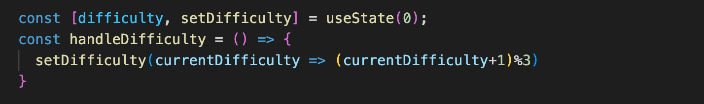
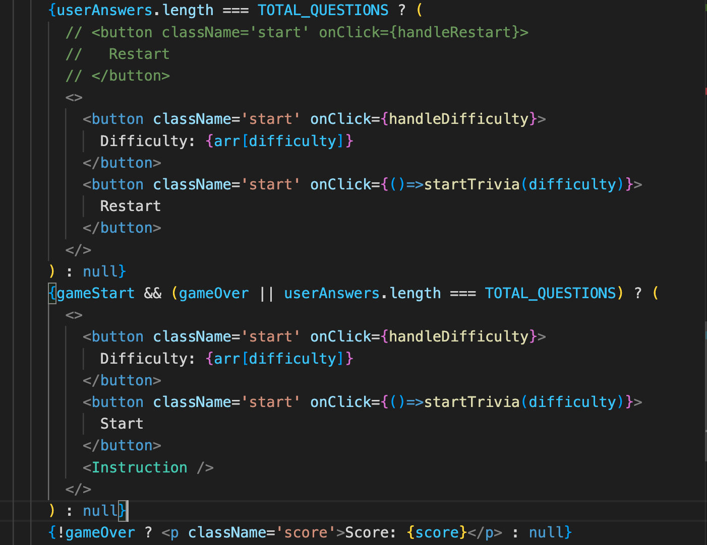

# Trivia Game
[live Website](https://trivia-vtue.onrender.com/)
## Background
This is a Trivia Game using [trivia game api](https://opentdb.com/api_config.php).
User can set level difficulty, then start the game. Each user is given 10 questions. Answering correctly will gain 1 point, no points are deducted for wrong answers.

## Technology
TypeScript, HTML, JavaScript, CSS

## Features
### How to Start
User can read instructions, and choose difficulty. Once they click start, game will start. 
Difficulty is setted using a react state.

### Gameplay
User's gameplay score will be recorded, correct answer will be counted towards score. 
Each component is mounted conditionally.

